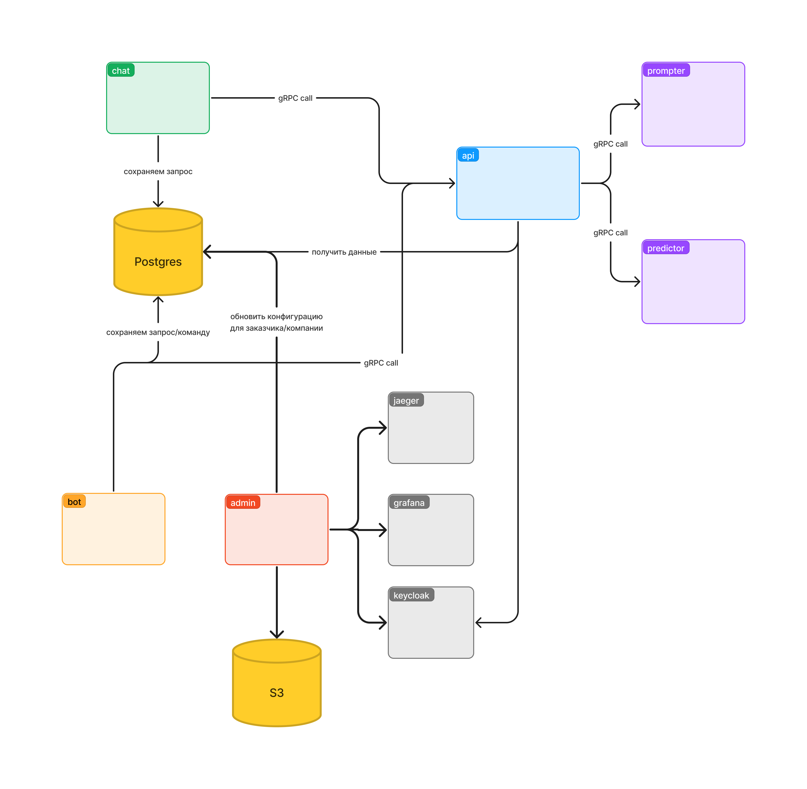
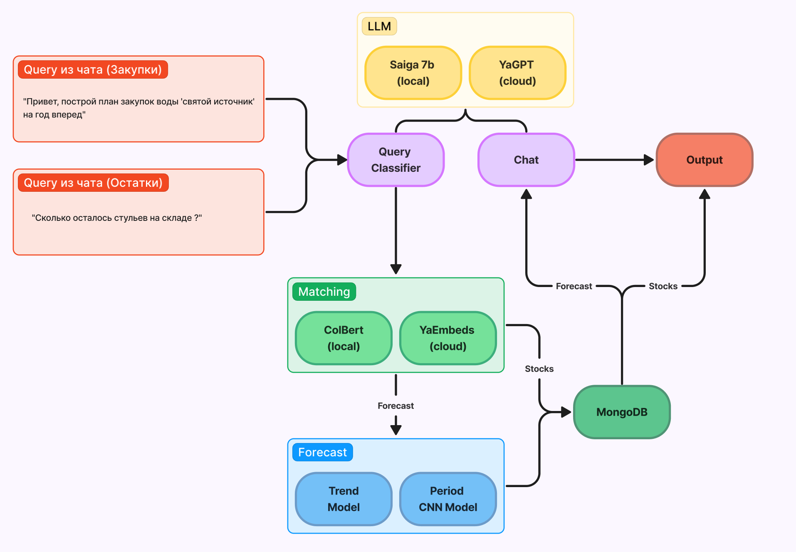
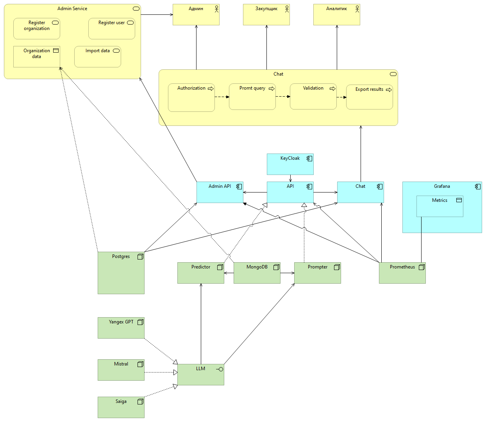

# ldt-2024 | Решение команды misis.tech

Наша команда разработала распределенную систему для прогнозирования и формирования закупок, используя микросервисный подход.

## [Ссылка на рабочий прототип](https://misis.larek.tech)

*данные для входа указаны в pdf документации к использованию сервиса.*

## [Скринкаст работы сервиса](https://youtu.be/YAmg0lAuX5w)

## Архитектура

### Сервисы

#### Веб-чат

Выступает главным сервисом для взаимодействия с пользователем через **удобный интерфейс общения в чате**, построенном на websocket соединении. Позволяет создавать сессии для разграничения и структурирования входящих запросов, а также в любой момент получать всю предыдущую историю в простом для восприятия формате с интерактивным графиками и отчетами.\
*Дополнительно доступ к сервису можно получить через бота в телеграм, который реализует функционал нашего сервиса в виде внутреннего веб приложения.*\
*В дальнейшем функционал чата в телеграм может расширяться независимо от веб версии.*

**[документация к сервису чата](https://api.misis.larek.tech/chat/swagger/index.html#/)**


#### Основное API

Реализует все методы для **получения предсказаний** и **формирования отчетов**. В качестве протокола общения наше API предоставляет на выбор **HTTP** или **gRPC**, что позволяет легко сделать сервис либо **независимым от чата**, либо быстро **интегрировать его в любую внешнюю систему**.

**[документация к api](https://api.misis.larek.tech/api/)**

#### Prompter

Сервис для обработки **пользовательских запросов на естественном языке**. Реализует всю логику, не завязываясь на выборе **LLM-модели**. Таким образом, можно задействовать **локально развернутую нейросеть**, если есть достаточно вычислительных мощностей, либо интегрировать **открытое API** других больших языковых моделей, например, **отечественной YandexGPT**.

#### Predictor

Все предсказания по закупкам и обработка данных для организаций проходят через сервис предсказаний, который **строит прогнозы и складывает их в MongoDB**. Данные парсятся **автоматически** для всех переданных файлов (формат данных предполагается совпадающим с выданным в ТЗ).


#### Admin

Панель доступа администратора, где он может **зарегистрировать свою организацию** и **создавать новых пользователей**. Открытой регистрации для пользователей в сервисе нет в **целях избежания утечки данных**. Администратор может загрузит архив с выгрузкой из 1С или другой системы, соблюдая представленный в ТЗ формат. В архиве должны содержаться только файлы, без вложенных папок.

**[документация к сервису администратора](https://api.misis.larek.tech/admin/swagger/index.html#/)**

## Архитектура системы



## Инструкция по локальному запуску

*В силу того, что некоторые сервисы требуют ручной настройки, которая может быть достаточно трудоемкой, рекомендуем использовать наш [прототип](https://misis.larek.tech).*\
\
*Для запуска требуется утилита **make** и **docker compose**.*\
\
*Все пути ниже указаны от корня директории **ldt-2024**.*

```bash
1. git clone https://github.com/yogenyslav/ldt-2024 && cd ldt-2024
2. настройка переменных окружения и конфигураций
    2.1. .env # пример в .env.example
    2.2. admin/config/config.yaml # пример в admin/config/config_example.yaml
    2.3. chat/config/config.yaml # пример в chat/config/config_example.yaml
    2.4. api/config/config.yaml # пример в api/config/config_example.yaml
    2.5. frontend/.env # пример в frontend/.env.example
3. make deps
4. настройка Minio S3
    4.1. зайти на http://localhost:9001 и авторизоваться, используя username и password из .env
    4.2. создать новый ключ доступ, скопировать 'access_key' и 'secret_key' в admin/config/config.yaml
5. настройка Keycloak
    5.1 зайти на http://localhost:8080 и авторизоваться, используя username и password из .env
    5.2. создать новый 'Realm' и 'Client' внутри него, обязательно выбирая тип OpenID connect и включая настройки 'Client authentication' и 'Authorization'
    5.3. скопировать название 'Realm' в конфигурации в папках admin, api и chat
    5.4. скопировать из вкладки 'Credentials' clientId и clientSecret в конфигурации в папках admin и api
    5.5. в настройках клиента во вкладке 'Service account roles' выбрать 'assign roles' и назначить роли: 'query-groups', 'view-groups', 'view-profile', 'view-users', 'query-users'
    5.6. создать группы с названиями admin, analyst и buyer (могут быть изменены в будущем по требованию)
    5.7. создать пользователя и пароль для него, обязательно добавив в группу admin
6. make run_all
```

## ML

### Стек технологий

Python, Torch, ColBert, Sentence Transformers, Ollama, Scikit-learn, Pandas

### Преимущества

1) Обучение на большом объеме синтетических данных
2) Предсказание в оффлайне с моментальным получением результата из базы во время запроса
3) Стабильность к предсказанию будущего за счет использования уникального подхода комбинации двух моделей 
4) Извлечение пожеланий пользователя на естественном языке
5) Персонализированный ответ с предсказанием
6) Возможность как локального разворачивания языковой модели, так и использования сторонних апи сервисов, в нашем случае отечественная разработка YandexGPT
7) Полная трассировка МЛ части сервисов
8) Безопасность данных пользователей и организаций

### Архитектура ML



### Реализация

Остатки и обороты есть только за последний год поквартально, при этом в большинстве случаев они не меняются в течении года. Поэтому на таких данных любые модели не будут работать.

Что делали мы:  
Обучались на истории контрактов (закупок), при этом объединяя товары в группы 3 или 4 уровня КПГЗ в зависимости от количества контрактов с данным товаром. 3 и 4 уровень КПГЗ достаточно точно описывает необходимость в конкретных товарах.
После получения прогноза по категориям, мы разбиваем этот прогноз на более конкретные товары на основании исторических данных. Извлекая цену из справочника, можем по сумме закупки оценить количество закупаемых товаров 

### Forecasting

#### Period Model

**Модель для предсказания периодов закупки**  
Поскольку у нас разреженный временной ряд (закупки происходят достаточно редко, обычно раз в несколько месяцев), то классические методы предсказания будут работать плохо. Поэтому мы использовали архитектуру на основе сверточных нейронных сетей (CNN).  
Но на предоставленных данных неизвестен период закупок, поэтому мы выявили основные шаблоны реальных данных и создали 5 миллионов синтетических временных рядов, где точно знаем период.   
На валидационной выборке точность предсказания периода меньше месяца.

#### Trend Model

**Модель для предсказания непрерывной суммы**  
Мы берём кумулятивную сумму по сумме закупок, таким образом получая новую непрерывную функцию. Далее эта функция аппроксимируется. Поскольку у нас есть предсказания периодов от первой модели, мы можем сделать обратное преобразование полученной функции, что даст нам необходимый разреженный временной ряд закупок на будущее 

#### Query Classifier

**Обработка запросов пользователей**  
Saiga 7b / YandexGPT
Используем LLM для извлечения информации из запроса юзера на естественном языке

#### Matching

**Матчинг позиций/категорий**  
ColBert (local) / Yandex Embeddings (cloud)  
Используем для матчинга извлеченного запроса юзера с базой товаров и категорий

#### Chat

**Генерация отчетов**  
*Saiga 7b / YandexGPT*  
Используем LLM с подобранными промтами и параметрами для стабильного, точного и персонализированного ответа пользователю с полученным предсказанием. Все модели не логируют данные для сохранения конфендициальности пользователя

#### Филтрация не регулярных закупок

1) Смотрим, что есть хотя бы 3 разных месяца в истории закупок для конкретной категории

2) Пытаемся построить предсказание. Если точность аппроксимации исходной функции меньше какого-то порога, то считаем закупку нерегулярной.

В итоге остаётся примерно 50% категорий товаров от изначального количества

## Backend

### Стек технологий

- **Golang**: основной язык, на котором написаны сервисы Admin, API и Chat, который позволил эффективно реализовать асинхронное взаимодействие с чатом параллельно для большого числа пользователей
- **PostgreSQL**: база данных для хранения запросов от пользователей и построенных прогнозов
- **MongoDB**: база данных для хранения данных внутри ML части нашей архитектуры
- **MinioS3**: облачное хранилище для загружаемых организациями данных
- **gRPC Gateway**: codegen для удобного представления gRPC методов по REST
- **Keycloak**: реализует авторизацию пользователей
- **Jaeger**: трассировка запросов
- **Prometheus / Grafana**: построение метрик

### Преимущества

Благодаря микросервисному подохду, основной функционал нашего решения может быть легко вынесен в независимый сервис или интегрирован во внешнюю систему.

В качестве протокола общения между сервисами использован gRPC, что позволит быстро создать реализации клиентов/сервисов с использованием любых других языков и технологий при необходимости.

Был сделан большой упор на безопасность и минимизацию рисков несанкционированного доступа к данным:

- система закрыта для внешних регистраций, пользователей могут создавать
только администраторы системы
- данные внутри четко разграничены между организациями, чтобы избежать пересечения доменных областей и утечек важной информации
- весь трафик в системе зашифрован
- для использования всех методов API как внутри приложения, так и в качестве внешней интеграции, требует получения JWT токена

## Frontend

### Стек технологий

- TypeScript: Статическая типизация для JavaScript.
- React: Компонентная библиотека для создания UI.
- MobX: Реактивное управление состоянием.
- Shadcn: Изоляция и стилизация компонентов.

### Преимущества

TypeScript, React, MobX и Shadcn используются вместе для создания модульных, безопасных и легко поддерживаемых веб-приложений.

## ArchiMate

#### Структура сервиса

